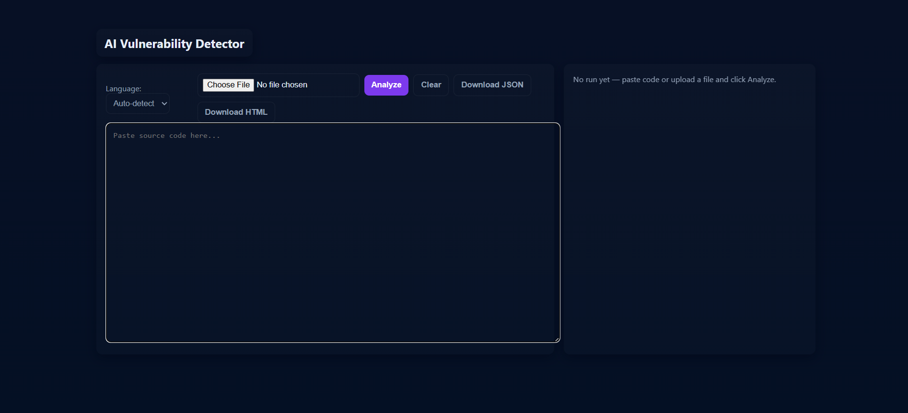
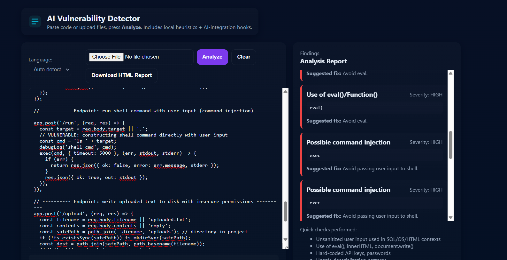
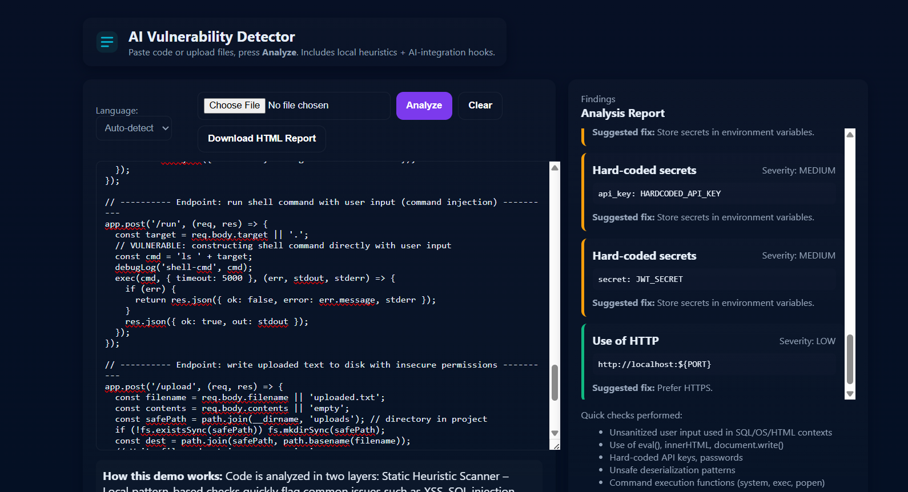
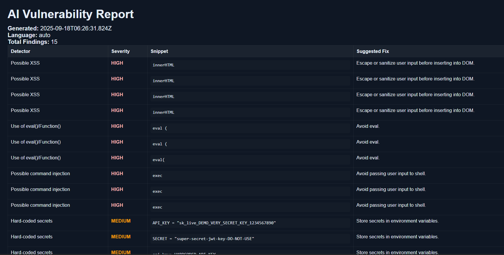

# 🔐 Smart Code Vulnerability Triage System

## 🚩 Problem Statement
Manually identifying **security vulnerabilities** in source code is both **time-consuming** and **error-prone**.  
Developers often miss subtle issues like:
- SQL injection
- Cross-Site Scripting (XSS)
- Hardcoded secrets  
These vulnerabilities, if left unchecked, can lead to severe exploits.  

The challenge: **Build a tool that scans source code automatically, flags risky patterns, and prioritizes them by severity** so developers can remediate efficiently.

---

## 💡 Our Approach
We designed a **hybrid vulnerability triage system** that combines fast static scanning with AI reasoning:

1. **Regex-based pattern matching**  
   - Quickly detects common insecure practices (`eval`, `innerHTML`, string-based SQL queries, etc.).

2. **Abstract Syntax Tree (AST) analysis**   
   - Provides deeper contextual understanding of the code instead of only text matching.

3. **Risk Scoring System**  
   - Classifies findings as **High / Medium / Low** based on the exploit impact.

4. **Structured Reporting**  
   - Exports results in **JSON, HTML, or CLI output**.  
   - Each report entry includes:
     - Vulnerability type  
     - Location in source file  
     - Severity level  
     - Suggested fix  

---

## 🎯 Hackathon Goal
- Showcase how **AI + static heuristics** can help developers **catch vulnerabilities earlier**.  
- Provide a **user-friendly interface** (paste/upload code) with **instant analysis & exportable reports**.  
- Demonstrate how LLMs (Hugging Face) can be integrated for **deeper contextual triage**.

---

## ✅ Current Implementation
- Regex-based scanner (JavaScript, Python, etc.)  
- Frontend web interface (`index.html`)  
- Export options: JSON / HTML reports  
- Prototype Kaggle backend (Hugging Face LLM integration)

---

Here’s how our tool looks in action:

### Downloaded Vulnerability Report

## ⚙️ Backend

The backend was prototyped and tested in a Kaggle environment.  
We used:
- Regex-based scanning
- AI triage (Hugging Face `distilbert-base-uncased-mnli`)
- Report generation (HTML / JSON)

👉 See [scanner.ipynb](scanner.ipynb) for the backend implementation.

